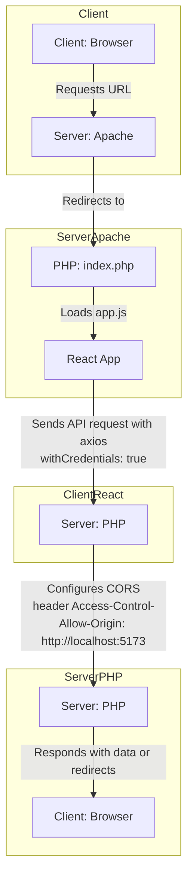

```mermaid
graph TD;
    subgraph Client
        A[Client: Browser] --> |Requests URL| B[Server: Apache]
    end
    
    subgraph ServerApache
        B --> |Redirects to| C[PHP: index.php]
        C --> |Loads app.js| D[React App]
    end
    
    subgraph ClientReact
        D --> |Sends API request with axios<br>withCredentials: true| E[Server: PHP]
    end
    
    subgraph ServerPHP
        E --> |Configures CORS<br>header Access-Control-Allow-Origin: http://localhost:5173| F[Server: PHP]
        F --> |Responds with data or redirects| G[Client: Browser]
    end
```