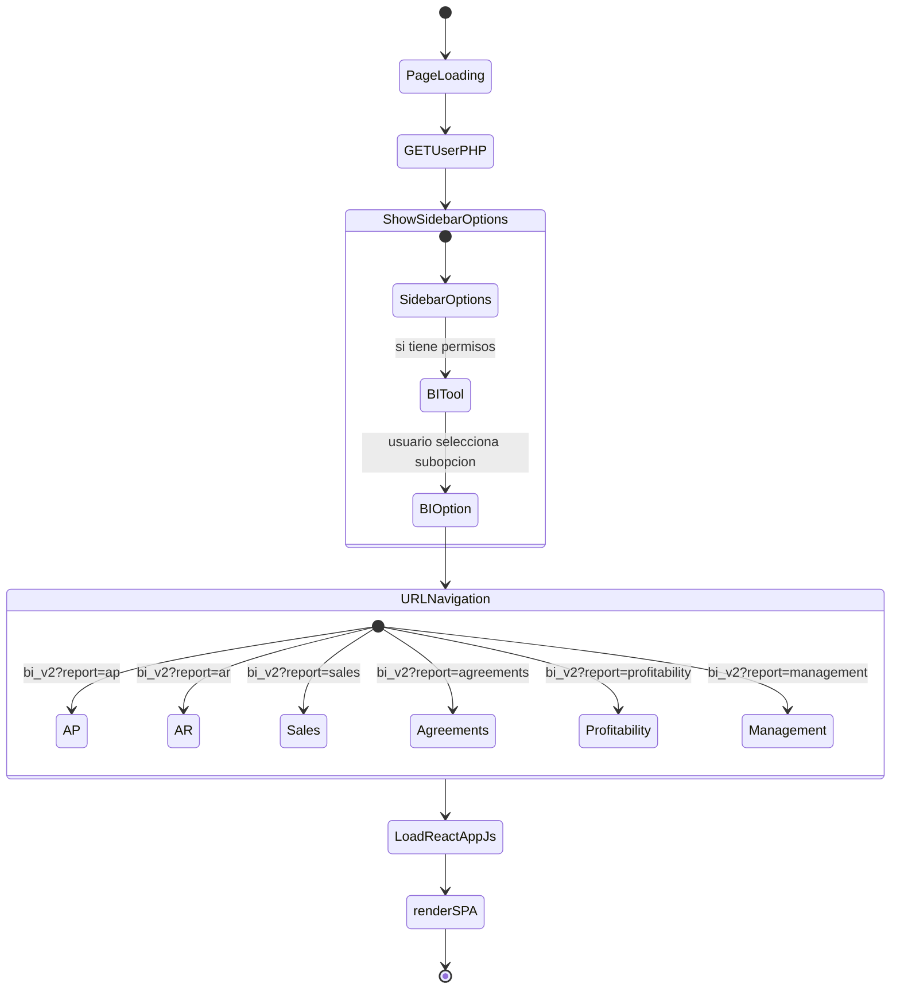

```mermaid
stateDiagram-v2
    [*] --> PageLoading
    PageLoading --> GETUserPHP
    GETUserPHP --> ShowSidebarOptions

    state ShowSidebarOptions {
        [*] --> SidebarOptions
        SidebarOptions --> BITool : si tiene permisos
        BITool --> BIOption : usuario selecciona subopcion
    }

    BIOption --> URLNavigation
    URLNavigation --> LoadReactAppJs
    LoadReactAppJs --> renderSPA

    state URLNavigation {
        [*] --> AP : bi_v2?report=ap
        [*] --> AR : bi_v2?report=ar
        [*] --> Sales : bi_v2?report=sales
        [*] --> Agreements : bi_v2?report=agreements
        [*] --> Profitability : bi_v2?report=profitability
        [*] --> Management : bi_v2?report=management
    }
    
    renderSPA --> [*]
```